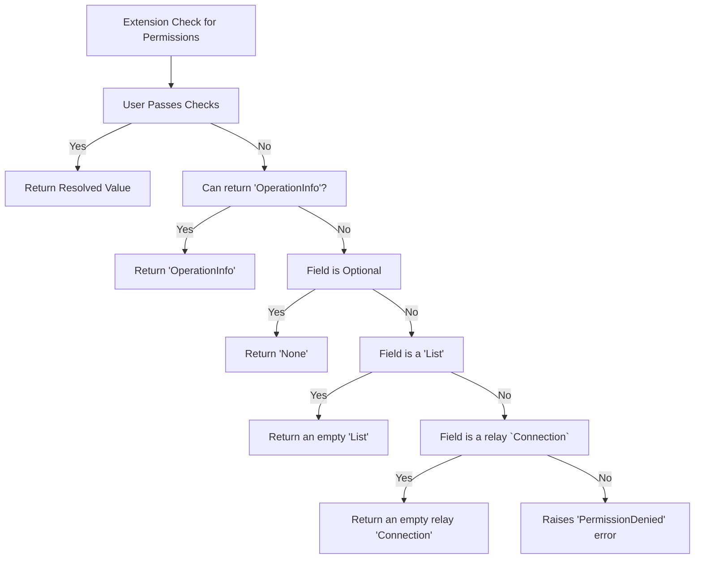

# Permissions

This integration exposes a field extension to extend fields into using the
[Django's Permissioning System](https://docs.djangoproject.com/en/4.2/topics/auth/default/)
for checking for permissions.

It supports protecting any field for cases like:

- The user is authenticated
- The user is a superuser
- The user or a group they belongs to has a given permission
- The user or the group they belongs has a given permission to the resolved value
- The user or the group they belongs has a given permission to the parent of the field
- etc

## How it works



## Example

```{.python title=types.py}
import strawberry
import strawberry_django
from strawberry_django.permissions import (
    IsAuthenticated,
    HasPerm,
    HasRetvalPerm,
)


@strawberry.type
class SomeType:
    login_required_field: RetType = strawberry_django.field(
        # will check if the user is authenticated
        extensions=[IsAuthenticated()],
    )
    perm_required_field: OtherType = strawberry_django.field(
        # will check if the user has `"some_app.some_perm"` permission
        extensions=[HasPerm("some_app.some_perm")],
    )
    obj_perm_required_field: OtherType = strawberry_django.field(
        # will check the permission for the resolved value
        extensions=[HasRetvalPerm("some_app.some_perm")],
    )
```

## Available Options

Available options are:

- `IsAuthenticated`: Checks if the user is authenticated (i.e. `user.is_autenticated`)
- `IsStaff`: Checks if the user is a staff member (i.e. `user.is_staff`)
- `IsSuperuser`: Checks if the user is a superuser (i.e. `user.is_superuser`)
- `HasPerm(perms: str | list[str], any_perm: bool = True)`: Checks if the user has any or all of
  the given permissions (i.e. `user.has_perm(perm)`)
- `HasSourcePerm(perms: str | list[str], any: bool = True)`: Checks if the user has any or all
  of the given permissions for the root of that field (i.e. `user.has_perm(perm, root)`)
- `HasRetvalPerm(perms: str | list[str], any: bool = True)`: Resolves the retval and then
  checks if the user has any or all of the given permissions for that specific value
  (i.e. `user.has_perm(perm, retval)`). If the return value is a list, this extension
  will filter the return value, removing objects that fails the check (check below for more
  information regarding other possibilities).

!!! note

    The `HasSourcePerm` and `HasRetvalPerm` require having an
    [authentication backend](https://docs.djangoproject.com/en/4.2/topics/auth/customizing/)
    which supports resolving object permissions. This lib works out of the box with
    [django-guardian](https://django-guardian.readthedocs.io/en/stable/), so if you are
    using it you don't need to do anything else.

## No Permission Handling

When the condition fails, the following will be returned on the field (following this priority):

1. `OperationInfo`/`OperationMessage` if those types are allowed at the return type
2. `null` in case the field is not mandatory (e.g. `String` or `[String]`)
3. An empty list in case the field is a list (e.g. `[String]!`)
4. An empty `Connection` in case the return type is a relay connection
5. Otherwise, an error will be raised

## Custom Permissions Checking

You can create your own permission checking extension by subclassing
`DjangoPermissionExtension` and implementing your own `resolve_for_user` method.
