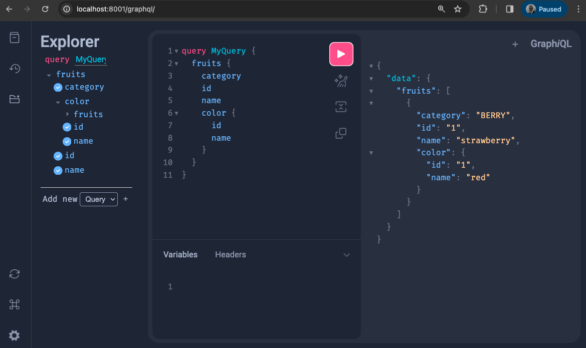

# Quick Start

In this Quick-Start, we will:

- Set up a basic pair of models with a relation between them.
- Add them to a graphql schema and serve the graph API.
- Query the graph API for model contents.

For a more advanced example of a similar setup including a set of mutations and more queries, please check the [example app](https://github.com/strawberry-graphql/strawberry-django/tree/main/examples/django).

## Installation

```sh
poetry add strawberry-graphql-django
poetry add django-choices-field  # Not required but recommended
```

(Not using poetry yet? `pip install strawberry-graphql-django` works fine too.)

## Define your application models

We'll build an example database of fruit and their colours.

> [!TIP]
> You'll notice that for `Fruit.category`, we use `TextChoicesField` instead of `TextField(choices=...)`.
> This allows strawberry-django to automatically use an enum in the graphQL schema, instead of
> a string which would be the default behaviour for TextField.
>
> See the [choices-field integration](./integrations/choices-field.md) for more information.

```python title="models.py"
from django.db import models
from django_choices_field import TextChoicesField

class FruitCategory(models.TextChoices):
    CITRUS = "citrus", "Citrus"
    BERRY = "berry", "Berry"

class Fruit(models.Model):
    """A tasty treat"""

    name = models.CharField(max_length=20, help_text="The name of the fruit variety")
    category = TextChoicesField(choices_enum=FruitCategory, help_text="The category of the fruit")
    color = models.ForeignKey(
        "Color",
        on_delete=models.CASCADE,
        related_name="fruits",
        blank=True,
        null=True,
        help_text="The color of this kind of fruit",
    )

class Color(models.Model):
    """The hue of your tasty treat"""

    name = models.CharField(
        max_length=20,
        help_text="The color name",
    )
```

You'll need to make migrations then migrate:

```sh
python manage.py makemigrations
python manage.py migrate
```

Now use the django shell, the admin, the loaddata command or whatever tool you like to load some fruits and colors. I've loaded a red strawberry (predictable, right?!) ready for later.

## Define types

Before creating queries, you have to define a `type` for each model. A `type` is a fundamental unit of the [schema](https://strawberry.rocks/docs/types/schema)
which describes the shape of the data that can be queried from the GraphQL server. Types can represent scalar values (like String, Int, Boolean, Float, and ID), enums, or complex objects that consist of many fields.

> [!TIP]
> A key feature of `strawberry-graphql-django` is that it provides helpers to create types from django models,
> by automatically inferring types (and even documentation!!) from the model fields.
>
> See the [fields guide](./guide/fields.md) for more information.

```python title="types.py"
import strawberry_django
from strawberry import auto

from . import models

@strawberry_django.type(models.Fruit)
class Fruit:
    id: auto
    name: auto
    category: auto
    color: "Color"  # Strawberry will understand that this refers to the "Color" type that's defined below

@strawberry_django.type(models.Color)
class Color:
    id: auto
    name: auto
    fruits: list[Fruit] # This tells strawberry about the ForeignKey to the Fruit model and how to represent the Fruit instances on that relation
```

## Build the queries and schema

Next we want to assemble the [schema](https://strawberry.rocks/docs/types/schema) from its building block types.

> [!WARNING]
> You'll notice a familiar statement, `fruits: list[Fruit]`. We already used this statement in the previous step in `types.py`.
> Seeing it twice can be a point of confusion when you're first getting to grips with graph and strawberry.
>
> The purpose here is similar but subtly different. Previously, the syntax defined that it was possible to make a query that **traverses** within the graph, from a Color to a list of Fruits.
> Here, the usage defines a [**root** query](https://strawberry.rocks/docs/general/queries) (a bit like an entrypoint into the graph).

> [!TIP]
> We add the `DjangoOptimizerExtension` here. Don't worry about why for now, but you're almost certain to want it.
>
> See the [optimizer guide](./guide/optimizer.md) for more information.

```python title="schema.py"
import strawberry
from strawberry_django.optimizer import DjangoOptimizerExtension

from .types import Fruit

@strawberry.type
class Query:
    fruits: list[Fruit] = strawberry_django.field()

schema = strawberry.Schema(
    query=Query,
    extensions=[
        DjangoOptimizerExtension,
    ],
)
```

## Serving the API

Now we're showing off. This isn't enabled by default, since existing django applications will likely
have model docstrings and help text that aren't user-oriented. But if you're starting clean (or overhauling
existing dosctrings and helptext), setting up the following is super useful for your API users.

If you don't set these true, you can always provide user-oriented descriptions. See the

```python title="settings.py"
STRAWBERRY_DJANGO = {
    "FIELD_DESCRIPTION_FROM_HELP_TEXT": True,
    "TYPE_DESCRIPTION_FROM_MODEL_DOCSTRING": True,
}
```

```python title="urls.py"
from django.urls import include, path
from strawberry.django.views import AsyncGraphQLView

from .schema import schema

urlpatterns = [
    path('graphql', AsyncGraphQLView.as_view(schema=schema)),
]
```

This generates following schema:

```graphql title="schema.graphql"
enum FruitCategory {
  CITRUS
  BERRY
}

"""
A tasty treat
"""
type Fruit {
  id: ID!
  name: String!
  category: FruitCategory!
  color: Color
}

type Color {
  id: ID!
  """
  field description
  """
  name: String!
  fruits: [Fruit!]
}

type Query {
  fruits: [Fruit!]!
}
```

## Using the API

Start your server with:

```sh
python manage.py runserver
```

Then visit [localhost:8000/graphql](http://localhost:8000/graphql) in your browser. You should see the graphql explorer being served by django.
Using the interactive query tool, you can query for the fruits you added earlier:



## Real-World Examples

Now that you have a basic API running, let's explore some common real-world scenarios.

### Adding Filters

Allow clients to filter fruits by category or color:

```python title="schema.py"
import strawberry
from strawberry_django.optimizer import DjangoOptimizerExtension
from strawberry_django import filters
from typing import Optional

from .types import Fruit, Color

@strawberry.type
class Query:
    @strawberry_django.field
    def fruits(
        self,
        category: Optional[str] = None,
        color_name: Optional[str] = None
    ) -> list[Fruit]:
        """Get fruits with optional filtering"""
        queryset = models.Fruit.objects.all()

        if category:
            queryset = queryset.filter(category=category)

        if color_name:
            queryset = queryset.filter(color__name__icontains=color_name)

        return queryset

schema = strawberry.Schema(
    query=Query,
    extensions=[
        DjangoOptimizerExtension,
    ],
)
```

Query with filters:

```graphql
query {
  fruits(category: "BERRY", colorName: "red") {
    name
    category
    color {
      name
    }
  }
}
```

### Adding Mutations

Allow clients to create and update fruits:

```python title="schema.py"
import strawberry
from strawberry_django import mutations
from .types import Fruit
from . import models

@strawberry.input
class CreateFruitInput:
    name: str
    category: str
    color_id: strawberry.ID

@strawberry.type
class Mutation:
    # Automatic CRUD mutations with Django error handling
    create_fruit: Fruit = mutations.create(
        models.Fruit,
        handle_django_errors=True
    )

    update_fruit: Fruit = mutations.update(
        models.Fruit,
        handle_django_errors=True
    )

    delete_fruit: Fruit = mutations.delete(
        models.Fruit,
        handle_django_errors=True
    )

schema = strawberry.Schema(
    query=Query,
    mutation=Mutation,
    extensions=[
        DjangoOptimizerExtension,
    ],
)
```

Create a fruit:

```graphql
mutation {
  createFruit(data: { name: "Blueberry", category: "BERRY", colorId: "1" }) {
    ... on Fruit {
      id
      name
      category
    }
    ... on OperationInfo {
      messages {
        field
        message
      }
    }
  }
}
```

### Adding Pagination

Limit the number of results for better performance:

```python title="schema.py"
from strawberry_django.pagination import OffsetPaginationInput

@strawberry.type
class Query:
    @strawberry_django.field
    def fruits(
        self,
        pagination: Optional[OffsetPaginationInput] = None
    ) -> list[Fruit]:
        """Get fruits with pagination"""
        queryset = models.Fruit.objects.all()

        if pagination:
            queryset = queryset[pagination.offset:pagination.offset + pagination.limit]
        else:
            queryset = queryset[:20]  # Default limit

        return queryset
```

Query with pagination:

```graphql
query {
  fruits(pagination: { offset: 0, limit: 10 }) {
    name
    category
  }
}
```

### Adding Authentication

Protect your API with authentication:

```python title="schema.py"
from strawberry.permission import BasePermission
from strawberry.types import Info

class IsAuthenticated(BasePermission):
    message = "User is not authenticated"

    def has_permission(self, source, info: Info, **kwargs) -> bool:
        return info.context.request.user.is_authenticated

@strawberry.type
class Mutation:
    @strawberry.mutation(permission_classes=[IsAuthenticated])
    def create_fruit(self, info: Info, name: str, category: str) -> Fruit:
        """Create a fruit (requires authentication)"""
        return models.Fruit.objects.create(
            name=name,
            category=category,
            created_by=info.context.request.user
        )
```

### Computed Fields

Add fields that are computed rather than stored:

```python title="types.py"
import strawberry_django
from strawberry import auto

@strawberry_django.type(models.Fruit)
class Fruit:
    id: auto
    name: auto
    category: auto
    color: "Color"

    @strawberry_django.field
    def display_name(self) -> str:
        """Computed field: formatted display name"""
        return f"{self.name} ({self.category})"

    @strawberry_django.field
    def is_citrus(self) -> bool:
        """Computed field: check if fruit is citrus"""
        return self.category == models.FruitCategory.CITRUS
```

Query computed fields:

```graphql
query {
  fruits {
    name
    displayName
    isCitrus
  }
}
```

### Optimizing Performance

The `DjangoOptimizerExtension` automatically prevents N+1 query problems:

```python
# Without optimizer: 1 query for fruits + N queries for colors (N+1 problem)
# With optimizer: 2 queries total (1 for fruits + 1 JOIN for colors)

@strawberry.type
class Query:
    fruits: list[Fruit] = strawberry_django.field()

# Query that fetches related data efficiently
query = """
  query {
    fruits {
      name
      color {
        name  # No N+1 problem thanks to optimizer!
      }
    }
  }
"""
```

See the [Performance Guide](./guide/performance.md) for more optimization strategies.

### Error Handling

Handle validation and database errors gracefully:

```python title="schema.py"
@strawberry.type
class Mutation:
    create_fruit: Fruit = mutations.create(
        models.Fruit,
        handle_django_errors=True  # Automatically returns structured errors
    )
```

Error response format:

```json
{
  "data": {
    "createFruit": {
      "__typename": "OperationInfo",
      "messages": [
        {
          "field": "name",
          "message": "This field is required",
          "kind": "VALIDATION"
        }
      ]
    }
  }
}
```

See the [Error Handling Guide](./guide/error-handling.md) for comprehensive error management.

## Complete Example

Here's a complete example bringing everything together:

```python title="schema.py"
import strawberry
from strawberry_django import mutations
from strawberry_django.optimizer import DjangoOptimizerExtension
from strawberry_django.pagination import OffsetPaginationInput
from strawberry.permission import BasePermission
from strawberry.types import Info
from typing import Optional

from .types import Fruit, Color
from . import models

class IsAuthenticated(BasePermission):
    message = "User is not authenticated"

    def has_permission(self, source, info: Info, **kwargs) -> bool:
        return info.context.request.user.is_authenticated

@strawberry.type
class Query:
    @strawberry_django.field
    def fruits(
        self,
        category: Optional[str] = None,
        pagination: Optional[OffsetPaginationInput] = None
    ) -> list[Fruit]:
        """Get fruits with optional filtering and pagination"""
        queryset = models.Fruit.objects.all()

        if category:
            queryset = queryset.filter(category=category)

        if pagination:
            queryset = queryset[pagination.offset:pagination.offset + pagination.limit]
        else:
            queryset = queryset[:20]

        return queryset

    @strawberry_django.field
    def fruit(self, id: strawberry.ID) -> Optional[Fruit]:
        """Get a single fruit by ID"""
        return models.Fruit.objects.filter(id=id).first()

    @strawberry_django.field
    def colors(self) -> list[Color]:
        """Get all colors"""
        return models.Color.objects.all()

@strawberry.type
class Mutation:
    # CRUD operations with automatic error handling
    create_fruit: Fruit = mutations.create(
        models.Fruit,
        handle_django_errors=True
    )

    update_fruit: Fruit = mutations.update(
        models.Fruit,
        handle_django_errors=True
    )

    @strawberry.mutation(permission_classes=[IsAuthenticated])
    def delete_fruit(self, info: Info, id: strawberry.ID) -> bool:
        """Delete a fruit (requires authentication)"""
        models.Fruit.objects.filter(id=id).delete()
        return True

schema = strawberry.Schema(
    query=Query,
    mutation=Mutation,
    extensions=[
        DjangoOptimizerExtension,  # Prevents N+1 queries
    ],
)
```

Example queries:

```graphql
# Get all fruits with their colors
query GetAllFruits {
  fruits {
    id
    name
    category
    displayName
    color {
      name
    }
  }
}

# Get filtered and paginated fruits
query GetBerries {
  fruits(category: "BERRY", pagination: { offset: 0, limit: 5 }) {
    name
    color {
      name
    }
  }
}

# Create a new fruit
mutation CreateFruit {
  createFruit(data: { name: "Raspberry", category: "BERRY", colorId: "1" }) {
    ... on Fruit {
      id
      name
      category
    }
    ... on OperationInfo {
      messages {
        field
        message
        kind
      }
    }
  }
}

# Update a fruit
mutation UpdateFruit {
  updateFruit(id: "1", data: { name: "Updated Strawberry" }) {
    ... on Fruit {
      id
      name
    }
    ... on OperationInfo {
      messages {
        field
        message
      }
    }
  }
}
```

## Next Steps

Now that you have a working GraphQL API with common features, explore these guides to learn more:

### Essential Guides

1. [Types](./guide/types.md) - Define complex GraphQL types from Django models
2. [Fields](./guide/fields.md) - Customize field behavior and add computed fields
3. [Mutations](./guide/mutations.md) - Create, update, and delete operations
4. [Filters](./guide/filters.md) - Advanced filtering capabilities
5. [Pagination](./guide/pagination.md) - Efficient data pagination strategies

### Performance & Optimization

6. [Query Optimizer](./guide/optimizer.md) - Prevent N+1 queries automatically
7. [Performance](./guide/performance.md) - Database optimization and caching
8. [DataLoaders](./guide/dataloaders.md) - Custom data loading patterns

### Security & Validation

9. [Permissions](./guide/permissions.md) - Protect your API with authorization
10. [Validation](./guide/validation.md) - Input validation and error handling
11. [Error Handling](./guide/error-handling.md) - Comprehensive error management
12. [Best Practices](./guide/best-practices.md) - Security and code quality

### Advanced Topics

13. [Relay](./guide/relay.md) - Relay-style pagination and connections
14. [Subscriptions](./guide/subscriptions.md) - Real-time updates with WebSockets
15. [Model Properties](./guide/model-properties.md) - Optimize computed properties
16. [Nested Mutations](./guide/nested-mutations.md) - Handle complex relationships
17. [Unit Testing](./guide/unit-testing.md) - Test your GraphQL API

### Help & Resources

- [FAQ](./faq.md) - Frequently asked questions
- [Troubleshooting](./guide/troubleshooting.md) - Common issues and solutions
- [Example App](https://github.com/strawberry-graphql/strawberry-django/tree/main/examples/django) - Complete working example
